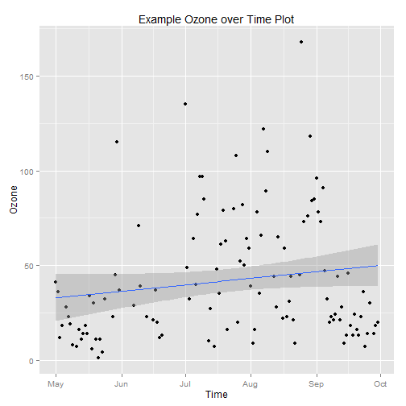
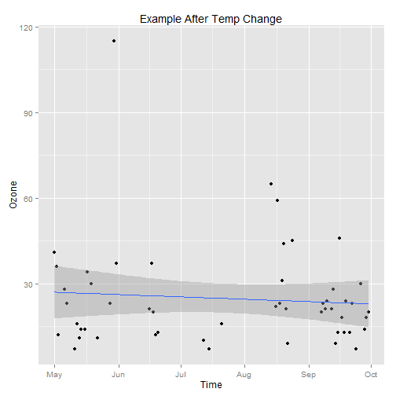

Course_Project
========================================================
author: Dawit Habtemariam
date: 08/22/2014


Introduction
========================================================

This is my RStudio presentation of my webpage. The webpage displays the
following:

- Choices of Y-Variables to plot over time
- Choice of range of temperatures to plot under
- Choice to display the basic statistics for each varaible

Data Source: New York Air Quality Measurements in 1973 

Variable Choices
========================================================
Your Y-variables to choose from are:

- Ozone
- Solar Radiation 
- Wind

 

Temperature Slider Feature
========================================================

The plot is displayed under your choice of temperature range.After choosing
your temperature range the plot displays all of the points under that range of 
temepratures.The following example displays the plot under the temperature range 63 to 81.


 

Summary Statistics
===
You can choose to display the basic statistics of the variables by checking the checkbox.


```
     Ozone          Solar.R         Wind            Temp     
 Min.   :  1.0   Min.   :  7   Min.   : 1.70   Min.   :56.0  
 1st Qu.: 18.0   1st Qu.:116   1st Qu.: 7.40   1st Qu.:72.0  
 Median : 31.5   Median :205   Median : 9.70   Median :79.0  
 Mean   : 42.1   Mean   :186   Mean   : 9.96   Mean   :77.9  
 3rd Qu.: 63.2   3rd Qu.:259   3rd Qu.:11.50   3rd Qu.:85.0  
 Max.   :168.0   Max.   :334   Max.   :20.70   Max.   :97.0  
 NA's   :37      NA's   :7                                   
     Month           Day            Time           
 Min.   :5.00   Min.   : 1.0   Min.   :1973-05-01  
 1st Qu.:6.00   1st Qu.: 8.0   1st Qu.:1973-06-08  
 Median :7.00   Median :16.0   Median :1973-07-16  
 Mean   :6.99   Mean   :15.8   Mean   :1973-07-16  
 3rd Qu.:8.00   3rd Qu.:23.0   3rd Qu.:1973-08-23  
 Max.   :9.00   Max.   :31.0   Max.   :1973-09-30  
                                                   
```

===

Thank You!


